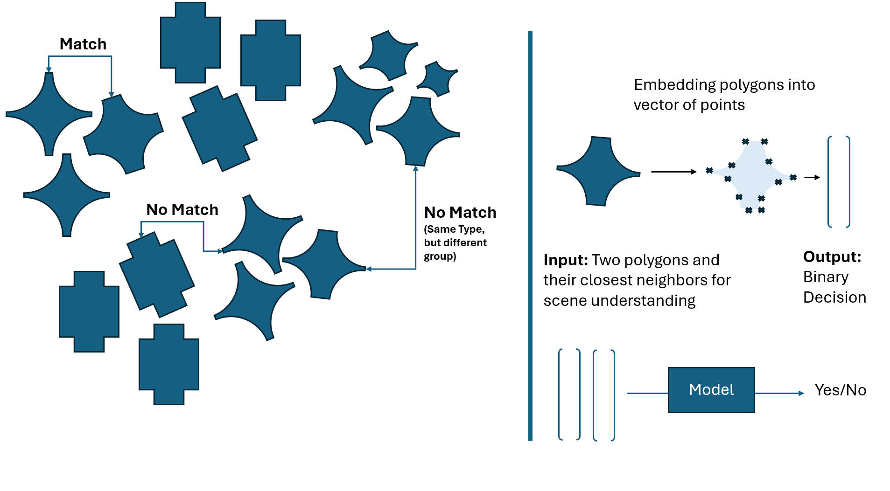

**Polygon Matching Pipeline**
This project is a pipeline for training a neural network based on Linear Layers, to predict if two polygons in a custom scenery belong to the same group. The form and location of the polygons are taken into account.
The scenery is learned implicitly by the network, and the polygons are represented by their vertices.
This makes this project especially useful when working with binary images, where the polygons are represented by their contours.
The general idea is visualized in the following image:

